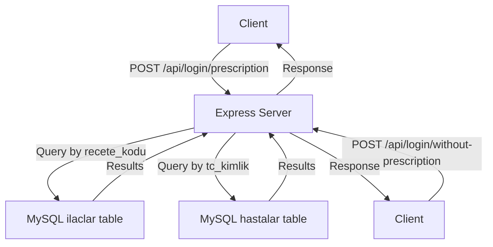
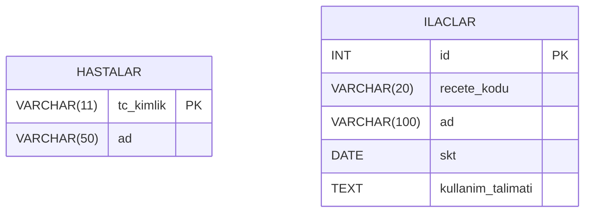

# Ilac Otomasyon Project Documentation

This documentation covers all major files of the "Ilac Otomasyon" project. The project is a simple Node.js/Express-based backend for a pharmaceutical automation system, supporting both prescription and non-prescription drug queries. Below you'll find details, diagrams, and comprehensive API endpoint documentation.

---

## server.js

This file is the main entry point for the backend server. It sets up the Express app, connects to a MySQL database, and exposes two REST API endpoints for logging in with or without a prescription.

### Key Features

- Loads environment variables from `.env`.
- Connects to a MySQL database using a connection pool.
- Exposes two main POST endpoints under `/api/login/`.
- Serves static files from a `public` directory.
- Handles JSON and URL-encoded request bodies.

### Implementation Overview

```js
require('dotenv').config();
const express = require('express');
const mysql = require('mysql2/promise');
const path = require('path');
const app = express();
const PORT = process.env.PORT || 3000;
app.use(express.json());
app.use(express.urlencoded({ extended: true }));
app.use(express.static(path.join(__dirname, 'public')));
(async () => {
  const pool = await mysql.createPool({
    host: process.env.DB_HOST,
    user: process.env.DB_USER,
    password: process.env.DB_PASSWORD,
    database: process.env.DB_NAME,
    waitForConnections: true,
    connectionLimit: 10
  });

  // Prescription login
  app.post('/api/login/prescription', async (req, res) => {
    const { code } = req.body;
    try {
      const [rows] = await pool.query(
        'SELECT id, ad, skt, kullanim_talimati FROM ilaclar WHERE recete_kodu = ?',
        [code]
      );
      if (rows.length === 0) {
        return res.status(400).json({ error: 'Hatalı kod girişi.' });
      }
      res.json({ drugs: rows });
    } catch (err) {
      console.error(err);
      res.status(500).json({ error: 'Sunucu hatası.' });
    }
  });

  // Non-prescription login
  app.post('/api/login/without-prescription', async (req, res) => {
    const { tc } = req.body;
    try {
      const [rows] = await pool.query(
        'SELECT tc_kimlik, ad FROM hastalar WHERE tc_kimlik = ?',
        [tc]
      );
      if (rows.length === 0) {
        return res.status(400).json({ error: 'Hatalı TC kimlik numarası.' });
      }
      res.json({ success: true });
    } catch (err) {
      console.error(err);
      res.status(500).json({ error: 'Sunucu hatası.' });
    }
  });

  app.listen(PORT, () => {
    console.log(`Server ${PORT} portunda çalışıyor.`);
  });
})();
```

---

### 🗺️ Request Flow



---

### API Endpoints

#### /api/login/prescription [POST]

##### Login with Prescription Code

This endpoint allows a user to log in by providing a prescription code and retrieves all drugs associated with that code.

```api
{
    "title": "Login with Prescription Code",
    "description": "Authenticate user with a prescription code and retrieve associated drugs.",
    "method": "POST",
    "baseUrl": "http://localhost:3000",
    "endpoint": "/api/login/prescription",
    "headers": [
        {
            "key": "Content-Type",
            "value": "application/json",
            "required": true
        }
    ],
    "queryParams": [],
    "pathParams": [],
    "bodyType": "json",
    "requestBody": "{\n  \"code\": \"CODE1\"\n}",
    "formData": [],
    "responses": {
        "200": {
            "description": "Returns drugs for the given prescription code.",
            "body": "{\n  \"drugs\": [\n    {\n      \"id\": 1,\n      \"ad\": \"Paracetamol\",\n      \"skt\": \"2025-12-31T00:00:00.000Z\",\n      \"kullanim_talimati\": \"Günde 3 kez, yemek sonrası alınız\"\n    },\n    {\n      \"id\": 2,\n      \"ad\": \"Ibuprofen\",\n      \"skt\": \"2024-06-30T00:00:00.000Z\",\n      \"kullanim_talimati\": \"Günde 2 kez, 200 mg, tok karnına alınız\"\n    }\n  ]\n}"
        },
        "400": {
            "description": "Invalid code.",
            "body": "{\n  \"error\": \"Hatalı kod girişi.\"\n}"
        },
        "500": {
            "description": "Server error.",
            "body": "{\n  \"error\": \"Sunucu hatası.\"\n}"
        }
    }
}
```

---

#### /api/login/without-prescription [POST]

##### Login with TC Identity Number

This endpoint lets a user log in without a prescription by providing their Turkish national ID number.

```api
{
    "title": "Login without Prescription",
    "description": "Authenticate user with TC identity number.",
    "method": "POST",
    "baseUrl": "http://localhost:3000",
    "endpoint": "/api/login/without-prescription",
    "headers": [
        {
            "key": "Content-Type",
            "value": "application/json",
            "required": true
        }
    ],
    "queryParams": [],
    "pathParams": [],
    "bodyType": "json",
    "requestBody": "{\n  \"tc\": \"12345678901\"\n}",
    "formData": [],
    "responses": {
        "200": {
            "description": "User authenticated.",
            "body": "{\n  \"success\": true\n}"
        },
        "400": {
            "description": "Invalid TC number.",
            "body": "{\n  \"error\": \"Hatalı TC kimlik numarası.\"\n}"
        },
        "500": {
            "description": "Server error.",
            "body": "{\n  \"error\": \"Sunucu hatası.\"\n}"
        }
    }
}
```

---

## package.json

This file manages the project dependencies and metadata. It also defines scripts for running the server.

### Main Properties

| Property       | Value                | Description                        |
| -------------- | ------------------- | ---------------------------------- |
| name           | "proje"             | Name of the project                |
| version        | "1.0.0"             | Project version                    |
| main           | "server.js"         | Entry point of the app             |
| scripts        | `{start, test}`     | Run and test commands              |
| dependencies   | See below           | Required NPM packages              |
| license        | ISC                  | Open source license                |

### Scripts

- `npm start` — Runs the server with Node.js.
- `npm test` — Placeholder test script.

### Dependencies

| Package    | Version    | Purpose                                              |
| ---------- | ---------- | ---------------------------------------------------- |
| dotenv     | ^16.5.0    | Load environment variables from .env                 |
| express    | ^5.1.0     | Web framework for building APIs                      |
| mysql2     | ^3.14.1    | MySQL client for Node.js supporting async/await      |

```json
{
  "name": "proje",
  "version": "1.0.0",
  "main": "server.js",
  "scripts": {
    "test": "echo \"Error: no test specified\" && exit 1",
    "start": "node server.js"
  },
  "keywords": [],
  "author": "",
  "license": "ISC",
  "description": "",
  "dependencies": {
    "dotenv": "^16.5.0",
    "express": "^5.1.0",
    "mysql2": "^3.14.1"
  }
}
```

---

## README.md

This file contains the project title and a brief name reference.

```markdown
# Ilac_Otomasyon_Projesi
# Ilac_Otomasyon
```

- The README should be expanded with project usage, setup instructions, and API documentation for real deployments.

---

## init.sql

This SQL script sets up the MySQL database schema and seeds it with sample data.

### Database Structure

- Creates a database called `eczane`
- Two main tables:
    - `hastalar` — For non-prescription users
    - `ilaclar` — For drugs associated with prescriptions

### Table Definitions

| Table      | Columns                                               | Purpose                                        |
| ---------- | ----------------------------------------------------- | ---------------------------------------------- |
| hastalar   | tc_kimlik (PK), ad                                    | Stores Turkish ID and name of patients         |
| ilaclar    | id (PK), recete_kodu, ad, skt, kullanim_talimati      | Stores drugs, expiration, instructions         |

### Sample Data

- Two patients in `hastalar`
- Four drugs (two per prescription code) in `ilaclar`

```sql
CREATE DATABASE IF NOT EXISTS eczane;
USE eczane;

-- Non-prescription users
CREATE TABLE IF NOT EXISTS hastalar (
  tc_kimlik VARCHAR(11) PRIMARY KEY,
  ad VARCHAR(50) NOT NULL
);

-- Prescription drugs (2 drugs per code)
CREATE TABLE IF NOT EXISTS ilaclar (
  id INT AUTO_INCREMENT PRIMARY KEY,
  recete_kodu VARCHAR(20) NOT NULL,
  ad VARCHAR(100) NOT NULL,
  skt DATE NOT NULL,
  kullanim_talimati TEXT NOT NULL
);

-- Sample patients
INSERT IGNORE INTO hastalar (tc_kimlik, ad) VALUES
  ('12345678901', 'Ahmet Yılmaz'),
  ('39876543210', 'Ayşe Demir');

-- Sample prescription drugs
INSERT IGNORE INTO ilaclar (recete_kodu, ad, skt, kullanim_talimati) VALUES
  ('CODE1', 'Paracetamol', '2025-12-31', 'Günde 3 kez, yemek sonrası alınız'),
  ('CODE1', 'Ibuprofen', '2024-06-30', 'Günde 2 kez, 200 mg, tok karnına alınız'),
  ('CODE2', 'Aspirin', '2025-03-31', 'Günde 1 kez, sabah aç karnına alınız'),
  ('CODE2', 'Naproksen', '2025-11-30', 'Günde 2 kez, 250 mg, yemek sonrası alınız');
```

---

### Database Schema Diagram



---

## .env

This file contains sensitive configuration variables for database access and the server port.

```
DB_HOST=localhost
DB_USER=root
DB_PASSWORD=""
DB_NAME=""
PORT=""
```

- **DB_HOST**: Hostname for the MySQL server.
- **DB_USER**: MySQL username.
- **DB_PASSWORD**: MySQL password.
- **DB_NAME**: The database name (should match `init.sql`).
- **PORT**: The port the Express server listens on.

---

## package-lock.json

This file is autogenerated by npm and locks the exact version of every installed package and dependency.

### Main Purposes

- Ensures consistent dependency installation across different environments.
- Provides a full dependency tree.
- Improves reliability and repeatability for builds.

### Structure

- Lists all direct and transitive dependencies.
- Includes URLs, checksums, and version numbers.

---

```card
{
    "title": "Best Practices Reminder",
    "content": "Never commit real credentials in .env files to a public repository."
}
```

---

# Summary

- **server.js**: Core Express backend with MySQL integration and two API endpoints.
- **package.json**: Declares dependencies and scripts for the project.
- **README.md**: Project name; should be expanded for real-world use.
- **init.sql**: Sets up and seeds the MySQL database.
- **.env**: Stores sensitive config like DB credentials.
- **package-lock.json**: Locks down dependency versions for reproducible installs.

This system allows you to authenticate and retrieve drug data via a simple API, using either a prescription code or a national ID. Modify and expand it according to your project needs!
